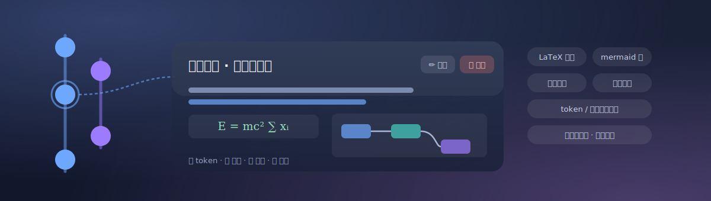
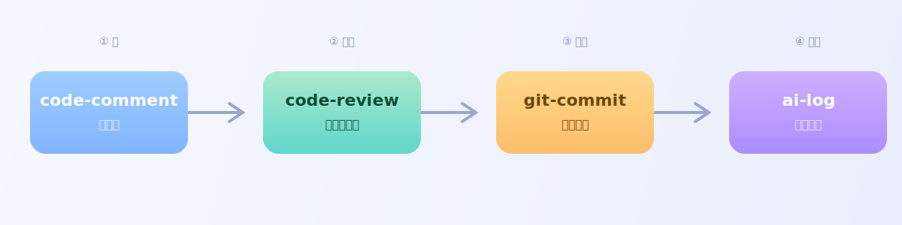
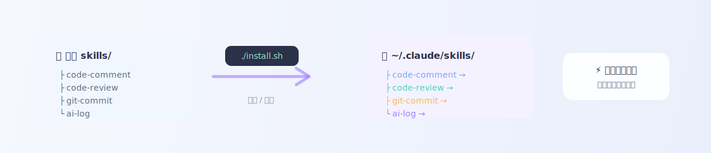

# claude-skills


一组可直接复用的 [Claude Code](https://docs.claude.com/en/docs/claude-code) / Agent Skills，沉淀日常开发中的工程规范与自动化能力。每个 skill 都是一个自包含目录，含 `SKILL.md`（带 YAML frontmatter）及其依赖资源，按需自动触发，不常驻占用上下文。

## 包含的 Skills

| Skill | 作用 | 触发时机 |
| ----- | ---- | -------- |
| [`code-comment`](skills/code-comment) | 代码注释规范：注释权责对齐当前作用域，不向上溯源调用链、不向下探索消费方、阶段性现状带时间戳、不写行号、不脑补业务 | 写 / 改任何代码注释（javadoc、行内、字段、测试注释）前 |
| [`code-review`](skills/code-review) | 提交前代码审查：按本次 diff 逐项查拼写、log 合理性（B 端关键节点合理打 / C 端校验失败不打）、注释、commit message、参数校验与边界；下游调 `code-comment`，可被 `git-commit` 触发 | 提交代码前 / 写 commit / push 前 |
| [`git-commit`](skills/git-commit) | Git 提交规范：基于 Conventional Commits，覆盖 type 选择、subject/body/footer 写法、`-F` 文件提交、精确暂存、amend 与强推安全、分支命名 | 写 commit message / 建分支 / push 前 |
| [`ai-log`](skills/ai-log) | 记录 AI 工作日志并生成可视化时间线：总结上次记录至今的工作写入按天 `data.json` 与离线 `index.html`；支持 markdown / mermaid / LaTeX、自动统计 token 与轮数、跨午夜接续、会话自定义名、条目编辑/删除/预览、多套主题；另有按主题 / 按轮次回溯整段对话的 full 模式；可选在线上报到 [Ailogy](https://github.com/icloudsheep/Ailogy) 服务做多设备聚合 | 收到「记录日志」「log 一下」类指令，或 `/ai-log full`、`/ai-log online` 时 |

## 新功能



`ai-log` 近期增强（详见 [skills/ai-log](skills/ai-log)）：

- **在线上报（双提交）**：`/ai-log online` 或「双提交」触发，写完本地后 POST 到 [Ailogy](https://github.com/icloudsheep/Ailogy) 后端，多台设备汇聚到一个库。每条带 `device` 设备字段，首次上报前会确认设备名；提交地址与设备名经 `--set-report-url` / `--set-device` 写入配置，尽力而为、失败不阻断本地写入。
- **LaTeX 公式**：日志正文支持 `$行内$` 与 `$$块级$$` 公式，内置 KaTeX 本地副本，离线可用、加载失败回退 CDN。
- **条目编辑 / 删除 / 预览**：详情面板与节点右键菜单可编辑（Markdown 源码框）、删除、预览任意一条；本地模式改动写 `localStorage` 并打印永久落盘命令（`--edit` / `--delete`），编辑原地更新、删除节点平滑移除，不整页重建。
- **节点悬停气泡**：鼠标停留即显示该条标题，快速浏览时间线。
- **渲染稳定性**：修复 mermaid 偶发渲染失败、玻璃主题连接线刷新、模态打开时吸顶头部消失、暗色编辑框可读性等问题。

> 工程结构上，`ai-log` 的脚本与模板也做了模块化重构：`ai_logger.py` 拆为 `ailog/` 包，`template.html` 由 `src/` 各部件经构建脚本拼装（见下文目录结构）。

## Skills 协作关系



这四个 skill 不是孤立的，围绕「写代码 → 审查 → 提交 → 记录」一条链路彼此衔接：

```
code-comment ──被调用──► code-review ──衔接──► git-commit
                              │                    │
                              └────────┬───────────┘
                                       ▼
                                    ai-log（汇总本段工作 + 审查/提交结果）
```

- **code-review → code-comment**：审查注释时，以 code-comment 的规范为准则。
- **code-review ↔ git-commit**：提交前先审查；审查通过后按 git-commit 规范写 message、暂存、提交。
- **ai-log ← 其余三者**：记录日志时，ai-log 可复用本段已有的产物（commit message、审查发现、注释改动）作为高质量正文素材，而非从零编造，以此提升效率与准确性。

> **互相调用需先征得用户同意**：以上联动是「允许」而非「自动」。任一 skill 在运行中要触发另一个 skill（例如 code-review 想顺手跑 git-commit 提交、或 ai-log 想去读取 git log / 审查结论）时，**必须先向用户说明要调用哪个 skill、做什么，获得明确许可后再执行**。用户未许可则只完成本 skill 职责，不擅自展开。


## 目录结构

```
skills/
├── ai-log/
│   ├── SKILL.md
│   ├── README.md
│   ├── version.js                # 版本信息（git 受控真源；日志目录软链指向它）
│   └── scripts/
│       ├── ai_logger.py          # 命令入口（薄封装，委托 ailog 包）
│       ├── ailog/                # 日志逻辑包：config/session/store/transcript/render/entry/cli
│       ├── template.html         # 可视化时间线模板（构建产物，由 src/ 拼装）
│       ├── src/                  # 模板源码部件：css/* + js/* + shell_*.html
│       ├── build/                # 构建脚本：build_template.py（拼装）/ check_template.py（校验）
│       ├── mermaid.min.js        # 本地 mermaid 渲染库（离线可用）
│       └── katex/                # 本地 KaTeX 公式库（katex.min.js/css + woff2 字体，离线可用）
├── code-comment/
│   ├── SKILL.md
│   └── README.md
├── code-review/
│   ├── SKILL.md
│   └── README.md
└── git-commit/
    ├── SKILL.md
    └── README.md
```

> 每个 skill 目录均含 `SKILL.md`（规范正文，带 YAML frontmatter，运行时加载）与 `README.md`（仓库浏览用的人读说明）。
> `ai-log` 的 `template.html` 是构建产物——改前端样式 / 逻辑请改 `scripts/src/` 下对应部件，再运行 `scripts/build/build_template.py` 重新拼装。

## 安装



将 skill 目录放到 Claude Code 能发现的位置即可：

- 用户级（全局生效）：`~/.claude/skills/`
- 项目级（随仓库共享）：`<repo>/.claude/skills/`

一键安装到用户级目录：

```bash
./install.sh            # 等价于 ./install.sh ~/.claude/skills
./install.sh <目标目录>  # 安装到指定目录
```

或手动软链 / 拷贝：

```bash
ln -s "$PWD/skills/code-comment" ~/.claude/skills/code-comment
ln -s "$PWD/skills/code-review"  ~/.claude/skills/code-review
ln -s "$PWD/skills/git-commit"   ~/.claude/skills/git-commit
ln -s "$PWD/skills/ai-log"       ~/.claude/skills/ai-log
```

### ai-log 的保存目录

`ai-log` 的脚本与模板放在 `skills/ai-log/scripts/` 下（命令入口 `ai_logger.py` + `ailog/` 逻辑包 + `template.html` 模板及其离线资产），脚本按自身位置定位模板，无需复制到任何固定路径。

日志保存目录由配置决定，不写死：

1. `--root <目录>`：仅本次生效。
2. `~/.config/ai-log/config.json` 的 `root`：永久位置（由 `--set-root` 写入）。
3. 兜底 `~/.cache/ai-log`：临时位置。

首次使用时 skill 会查询状态（`--status`），若未永久指定则询问用户是否要永久指定一个目录；用户选定后写入配置文件（不污染 SKILL.md），之后不再打扰。脚本会读取环境变量：

- `CLAUDE_CODE_SESSION_ID`：派生稳定的会话代号（同会话恒定）。
- `ANTHROPIC_MODEL`：记录当前模型名（可选）。
- `AILOG_REPORT_URL` / `AILOG_DEVICE`：在线上报到 [Ailogy](https://github.com/icloudsheep/Ailogy) 时的目标地址与本机设备名（也可由 `--set-report-url` / `--set-device` 写入 config.json）。

### 在线上报到 Ailogy（可选）

`ai-log` 默认纯本地。若想把多台设备的日志汇聚到一处并用网页瀑布流浏览，可部署 [Ailogy](https://github.com/icloudsheep/Ailogy) 服务，并在 CLI 侧配置上报地址与设备名：

```bash
ai_logger.py --set-report-url http://127.0.0.1:8000   # 上报地址（只需根地址）
ai_logger.py --set-device "我的 MacBook"               # 设备名（多设备区分来源）
ai_logger.py --report --title "..." --summary "..."   # 记一条并上报（本地仍照写）
```

上报是尽力而为，失败不阻断本地写入。详见 [skills/ai-log](skills/ai-log) 与 Ailogy 仓库。

## 许可证

[MIT](LICENSE)

## 参考与致谢

开发、运行与宣传中参考或依赖的工具、库、平台与资源见 [CREDITS.md](CREDITS.md)。
