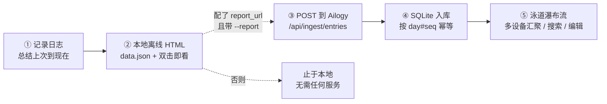

# ai-log

记录 AI 工作日志 skill。把「上次记录到现在」的工作内容总结后，追加写入按天目录的结构化数据与可视化时间线；可选在线上报到 [Ailogy](https://github.com/icloudsheep/Ailogy) 服务做多设备聚合。

> **职责边界**：ai-log 是**客户端**，专职「记录日志 + 本地离线渲染 +（可选）推送云端」，自包含、可独立使用；[Ailogy](https://github.com/icloudsheep/Ailogy) 是**纯后端**，只负责收集 / 存储 / 网页呈现多设备汇聚的日志，自身不产生日志。二者靠 ai-log 侧配置的 `report_url` 单向对接：
> - **只装 ai-log**：全功能本地离线，双击 HTML 即看，无需任何服务。
> - **ai-log 配了云端地址 + Ailogy 后端在跑**：本地 + 云端双写。
>
> 云端地址配在 ai-log 自己的 `config.json`（`report_url`），**不在 Ailogy 的 `.env` 里**——谁记日志谁决定往哪推。

## 适用场景

收到「记录日志」「记一下日志」「log 一下」类指令时触发。

**两种总结模式**：
- **分段模式（默认）**：总结上次记录到现在这一时间段，产出 1 条日志。
- **full 模式**（`/ai-log full` 或「按主题/按每轮总结所有对话」）：回看整段对话、一次产出多条日志，按出现顺序串行切分时间，节点带 🚀 角标。执行前会征得用户许可，并让其选**颗粒度**（按对话主题 / 按每轮对话）与**数据来源**（读 transcript / 凭当前上下文）。更耗 token。

**两种落点**（可叠加）：
- **本地离线（默认）**：写按天目录的 `data.json` + 离线 `index.html`，双击即看。
- **在线上报**（`/ai-log online` 或「双提交」「在线提交」，即 `--report`）：写完本地后额外 POST 到 Ailogy 后端，多台设备汇聚到一个库。尽力而为，失败不阻断本地写入。

## 运行流程

一条日志从产生到（可选）汇聚云端，走下面的链路。**前两步始终发生、只在本机；后三步只有在「配了 `report_url` + Ailogy 后端在跑」时才发生。**



1. **记录**：说「记录日志」，skill 总结「上次记录到现在」的工作，拟标题 + 正文。
2. **本地离线渲染（始终发生）**：写 `data.json` 并生成离线 `index.html`，双击即看，**不需要网络、不需要任何服务**。只装 ai-log 到这一步就已全功能可用。
3. **上报判定**：仅当 `config.json` 配了 `report_url`、且本次带 `--report`（或用户说「双提交 / 在线提交」）时，才把这条 POST 到 Ailogy；否则流程止于本地。
4. **入库**：Ailogy 后端校验并按 `day#seq` 幂等写入 SQLite（重复上报覆盖而非重复插入）。
5. **查看**：浏览器打开瀑布流，按月 / 设备筛选、全文搜索、编辑 / 删除 / 改色。

| 装了什么 | 记录 | 本地离线 HTML | 云端汇聚 / 瀑布流 |
| --- | --- | --- | --- |
| 只有 ai-log | ✅ | ✅ | ❌ |
| ai-log 配了 `report_url` + Ailogy 后端在跑 | ✅ | ✅ | ✅ |

> 后端没起、或没配 `report_url` 时，带 `--report` 只告警、**不阻断本地写入**。

## 保存目录如何确定

脚本**不写死任何路径**。保存目录按优先级解析：

1. `--root <目录>`：仅本次生效，不落盘。
2. `~/.config/ai-log/config.json` 的 `root`：永久位置，由 `--set-root` 写入。
3. 兜底 `~/.cache/ai-log`：临时位置，未永久指定时使用。

（`~/.config` / `~/.cache` 分别尊重 `XDG_CONFIG_HOME` / `XDG_CACHE_HOME`。）

**首次使用**：skill 会先 `--status` 查状态，若 `configured:false` 则询问用户是否要永久指定一个目录。用户给目录就 `--set-root` 永久落盘；暂不指定则本次落临时兜底目录，下次再问。永久路径只存进独立配置文件，不污染 SKILL.md。

## 在线上报（双提交）

用户明确说「双提交」「在线提交」「同步到线上」或 `/ai-log online` 时，记录命令追加 `--report`。提交目标按 `环境变量 AILOG_REPORT_URL > config.json 的 report_url > 空（不报）` 解析，只需根地址（自动拼 `/api/ingest/entries`）。

**设备标签**：每条上报带 `device` 字段供 Ailogy 筛选。解析优先级为 `AILOG_DEVICE > config.json.device > 短主机名建议值`。它不是硬件唯一标识。首次上报且 `device_configured:false` 时，必须通过 Claude Code 或 Codex 当前可用的询问机制让用户确认，再用 `--set-device <名称>` 写入；多台设备应使用不同、稳定的人类可读名称。

```bash
ai_logger.py --set-report-url http://127.0.0.1:8000   # 永久指定上报地址
ai_logger.py --set-device "我的 MacBook"               # 永久指定设备名
ai_logger.py --report --title "..." --summary "..."   # 记一条并上报
```

**想启用云端的操作顺序**：① 先把 Ailogy 后端跑起来（见其 README）；② 在本机 ai-log 侧 `--set-report-url` 指到该服务根地址、`--set-device` 起个设备名；③ 之后记日志时带 `--report`（或说「双提交」）即双写。未配 `report_url` 时带 `--report` 只提示未配置、不报错；配了但后端没起则本地照存、上报失败仅告警——本地写入永不受影响。

## 工作流程

1. **查状态 / 按需询问**：`ai_logger.py --status`（输出含 `root` / `report_url` / `device` / `device_configured`），未永久指定保存目录时询问；若用户要上报且设备未配置则先问设备名。
2. **拟标题 + 总结**：先拟一句标题（≤25 字），再概述上次记录至今的工作（正文默认 2000 字内，不写一级大标题、只用小标题与列表；可用 markdown、mermaid 图与 LaTeX 公式）。
   - **复用同仓库其他 skill 的产物**：本段若用过 `git-commit` / `code-review` / `code-comment`，优先把现成的 commit message、审查发现、注释结论提炼进正文，而非从零归纳。仅**读取本会话已有结论 / 已存在的 commit message** 属轻量引用可直接用；若要**主动触发**另一个 skill 现做，须先征得用户同意。
3. **写入**：调用 `ai_logger.py --title "<标题>" --summary "<总结>"`（summary 用单引号 heredoc 传参避免 shell 篡改）；要上报则加 `--report`。
4. **确认**：仅输出一句确认。

## 脚本接口

```bash
ai_logger.py --status                                        # 输出配置状态 JSON，不写日志
ai_logger.py --title "..." --summary "..."                   # 按当前配置/兜底记一条（本地）
ai_logger.py --title "..." --summary "..." --root <目录>      # 本次临时指定目录
ai_logger.py --set-root <目录> [--title ... --summary ...]    # 永久指定目录（可顺带记一条）
ai_logger.py --summary "..." --id <会话名>                    # 手动覆盖会话代号
ai_logger.py --mode full --title "..." --summary "..."        # full 模式条目（🚀 角标）
ai_logger.py --rename "<会话id>" "<自定义名>"                  # 永久重命名会话（写 aliases.json + 重渲染）
ai_logger.py --edit "<日期>" <序号> --title ... --summary ...  # 永久编辑某条并重渲染该日 HTML
ai_logger.py --delete "<日期>" <序号>                          # 永久删除某条并重渲染该日 HTML
ai_logger.py --rerender                                       # 模板升级后把新模板铺到所有历史页面
ai_logger.py --report --title "..." --summary "..."           # 记一条并在线上报到 Ailogy
ai_logger.py --set-report-url <URL>                           # 永久指定上报地址
ai_logger.py --set-device <NAME>                              # 永久指定上报设备名
```

脚本同时支持 Claude Code 与 Codex。会话 ID 优先级为 `--session-id > AILOG_SESSION_ID > CODEX_THREAD_ID / CLAUDE_CODE_SESSION_ID`；模型优先级为 `--model > AILOG_MODEL > 平台信息`。`--status` 会输出最终的平台、会话 ID、模型与 transcript 路径，便于诊断。

## token / 轮数统计

Claude Code transcript 默认从 `${CLAUDE_CONFIG_DIR:-~/.claude}/projects` 定位；Codex 默认从 `${CODEX_HOME:-~/.codex}/sessions` 定位。也可用 `--transcript` / `AILOG_TRANSCRIPT` 显式覆盖。脚本统计上一条日志之后的 input/output/cache tokens、轮数与调用数；平台内部格式变化或 transcript 不可用时省略 `usage`，UI 自动隐藏。

## 自定义会话名称

自动代号（`Fox-3f2a`）可重命名，**跨所有日期对同一会话生效**，展示为「自定义名(自动代号)」（括号内半透明小字）。两层：

- **网页右键胶囊**：鼠标位置动画弹出菜单 → 输入名称写 `localStorage`，即时生效、跨所有日期同源共享；换浏览器/清缓存会丢。
- **`--rename` 命令**：写 `<root>/aliases.json` 并刷新 `<root>/aliases.js`，永久保留。渲染时 localStorage 软别名优先于硬别名。

> **零重渲染**：数据走外部 JS 资产——每天页面引用 `./data.js`、所有页面共享 `../aliases.js`（`file://` 下 `<script src>` 不受 CORS 限制）。改别名只重写 `aliases.js` 一个文件，所有页面刷新即生效，无需重渲染 HTML。三件套需保持目录结构在一起。

## 编辑 / 删除 / 预览条目

详情面板与节点右键菜单可**预览**、**编辑**（Markdown 源码框，⌘/Ctrl+Enter 保存）、**删除**任意一条。两层：

- **网页操作**：改动即时写 `localStorage`（键 `ai-log:edits`，按 `日期#seq` 定位），跨同源所有日期、刷新即生效；控制台同时打印永久落盘命令。
- **脚本固化**：`--edit "<日期>" <序号> --title/--summary` 改写 `data.json` 并重渲染该日 HTML；`--delete "<日期>" <序号>` 移除条目（其余 seq 不变）并重渲染。

> 在线上报到 Ailogy 时，编辑 / 删除 / 改色由 Ailogy 网页直接固化到其 SQLite（与本地离线模式各自独立）。

## 跨午夜接续

当天本会话还没记录、但更早日期里有本会话的尾巴时，脚本会把新日志存到**今天**，起点继承昨日结束时间、时长按真实跨日计算，并写入 `carryover` 字段。网页在该条详情面板与时间线节点（🌙 角标）上标注「前一部分在上一日」。无需传任何跨日参数。

## 产物（`<root>/{YYYY-MM-DD}/`）

- `data.json`：结构化数据真源，含 `title`、会话代号、起止时间、项目、分支、模型、总结等字段，跨日条目附 `carryover`，有 transcript 时附 `usage`(token/轮数)。
- `data.js`：当天数据的 JS 资产（由 data.json 生成），供 index.html 以 `<script src>` 加载。
- `aliases.json` / `aliases.js`（root 根目录）：会话别名底稿与其 JS 资产，跨所有日期共享，由 `--rename` 维护。
- `index.html`：纯静态模板，运行时读 `./data.js` 与 `../aliases.js` 渲染时间线，标题在详情面板顶部单独展示，胶囊左键切显隐/右键弹出菜单改名，双击离线打开。

## 依赖文件

`scripts/ai_logger.py`（薄入口，委托 `scripts/ailog/` 包）与 `scripts/template.html` 必须同目录（脚本按自身位置定位模板）。无需把它们复制到任何固定路径——保存目录由配置决定。

完整规范见 [`SKILL.md`](SKILL.md)。
