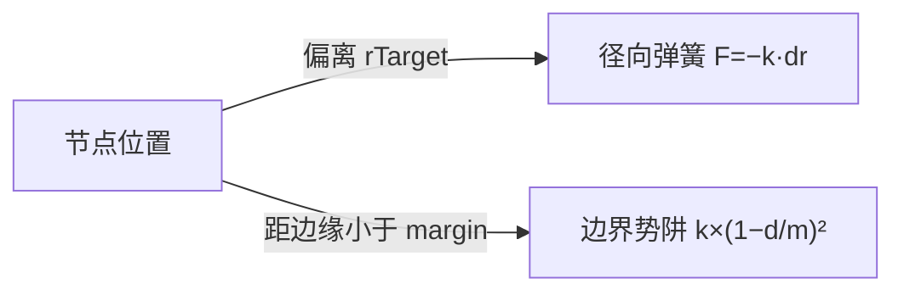

# ai-log 使用踩坑与解决方案

真实使用中反复遇到的堵点，按触发场景归纳。每条含**症状 → 根因 → 解法**三段，供后续维护者与 AI 助手参考。

---

## 1. Mermaid 图标签里含 `-` / `<` / `>` / `×` 渲染失败

**症状**
写完日志刷新网页，mermaid 图不显示或抛"Parse error"。特别常见的写法：

```mermaid
graph LR
  A[节点位置] -->|偏离 rTarget| B[径向弹簧 -k·dr]
  A -->|距边缘 < margin| C[边界势阱 k×(1-d/m)²]
```

**根因**
mermaid 的语义关键字与常见公式记号冲突：
- `-` 起头的标签被解析成箭头起始（`-->` 的一半）
- `<` / `>` 是 `<--` / `-->` 的一部分，即使在标签内也可能触发
- `×`、`²` 单独一般 OK，但和上面的字符组合会连锁失败

**解法**
节点标签 & 边标签**全部加双引号**，mermaid 遇引号视作纯文本、忽略特殊字符：



额外保险：
- `-` 前置改成 `F=−k·dr`（前缀 `F=`）+ **全角减号 `−`**
- `<` / `>` 改成"小于"/"大于"汉字，即使加引号也建议避开

---

## 2. `--summary` 用双引号导致 markdown 全部失效

**症状**
写好一段带 `#` 标题、`-` 列表的 markdown，网页上却全部堆在一段里、没换行。

**根因**
用双引号传参：
```bash
python3 ai_logger.py --summary "第一行\n- 列表项"
```
Bash 双引号里的 `\n` **是字面反斜杠 + n**，不是换行符。skill 里的 `renderMd` 按真实换行逐行扫，所以整段被视作一个段落。

更严重的是内容里的 `$VAR` / `` `cmd` `` 会被 Bash 展开甚至执行，可能把命令搞崩。

**解法**
一律用**单引号 heredoc**：

```bash
SUMMARY=$(cat <<'EOF'
## 小标题
- 列表项
`行内代码` 与 **加粗**
EOF
)
python3 ai_logger.py --title "标题" --summary "$SUMMARY"
```

`<<'EOF'` 单引号禁用 Bash 所有展开：换行原样、`$` `` ` `` `!` 不被解释。

---

## 3. `--edit` 加 `--report` 参数无效，云端仍是旧内容

**症状**
用 `--edit "2026-07-15" 1 --summary "..." --report` 修正历史日志，本地网页更新了，但云端 Ailogy 上的这条仍是旧版本。

**根因**
翻源码发现 `cli.py` 里 `--edit` 分支写入本地后**直接 return**，不检查 `--report` 也不执行上报。同理 `--delete` 分支也一样。这个设计是历史遗留：`--edit` 假设"只改本地"，云端另有 UI 修改路径。

**解法**（两选一）
- **A. 用 Ailogy 的 ingest 接口直接补一次上报**（推荐）：
  ```python
  import json, httpx
  data = json.load(open("<root>/2026-07-15/data.json"))
  entry = next(e for e in data["entries"] if e["seq"] == 1)
  entry["device"] = "本机设备名"
  entry["day"] = "2026-07-15"
  httpx.post("http://127.0.0.1:8000/api/ingest/entries", json=[entry])
  ```
  `client_id = day#seq` 是幂等键，重上报直接覆盖，无副作用。

- **B. 网页端手动编辑**：Ailogy 前端每条日志的详情面板有 ✏️ 编辑按钮，直接改。

---

## 4. `--set-root` 之后配置写了，日志却没落到那儿

**症状**
执行 `python3 ai_logger.py --set-root /path/to/dir`，`--status` 也显示 `configured: true` 且 root 是新值，但下次记日志时看到本地目录空的。

**根因**
`--set-root` 独立成一个动作，**不自动带上记一条日志的动作**。文档里明确说"若同时给了 `--summary` 才立即记一条"：

```
1. 用户本次选择永久指定目录：永久落盘 + 立即记一条
python3 ai_logger.py --set-root "/dir" --title "标题" --summary "$SUMMARY"
```

**解法**
两种：
- 分两次：先 `--set-root`，再单独跑 `--title / --summary`
- 一次搞定：`--set-root` 与 `--title / --summary` 同时给

---

## 5. 云端上报失败但本地保存了，看不到明显提示

**症状**
执行带 `--report` 的命令后终端只看到本地保存的 ✅，没看到 📤 也没看到 ⚠️——不确定云端上没上。

**根因**
skill 的输出对上报是"尽力而为"，成功打印 `📤 已在线提交至 <url>（设备 X）`，失败打印 `⚠️ 在线提交失败（本地已保存）：<原因>`。**如果两者都没有**，最常见原因是 `--report` 参数没生效——通常是**跟 `--edit` / `--delete` 组合**（见第 3 点）。

普通场景下（分段 & full 模式）如果配了 `report_url` 且加了 `--report`，一定会打印两句之一。

**解法**
- 用 `--status` 确认 `report_url` 已配
- 检查命令有没有 `--report`
- 若终端输出被截断，用 `tail -3` 查看结尾几行
- 检查 Ailogy 后端在跑（`curl http://127.0.0.1:8000/health`）

---

## 6. 会话别名 `--rename` 后其他日期页面没变

**症状**
用 `--rename "Bat-8da0" "拟真行星"` 改会话名，当天页面显示新名了，但打开昨天的日志页面仍是旧的自动代号。

**根因**
别名走**外部 JS 资产**：所有日期页面共享 `<root>/aliases.js`（`window.AILOG_ALIASES = {...}`）。skill 只重写 `aliases.js` 一个文件，不重渲染任何 HTML。老页面**刷新**（cmd+R）就能读到新别名，未刷新的浏览器缓存里还是旧的。

**解法**
- 打开浏览器就刷新一下页面
- 若开发环境有 http server（不用 `file://`），可能有更强的缓存策略，试试硬刷（cmd+shift+R）
- 别名可以用**网页端右键**（会即时写 localStorage 生效）作为快速验证，然后再跑 `--rename` 固化

---

## 7. 跨午夜时段的日志被拆到两天，节点显示混乱

**症状**
凌晨 0:15 记一条日志，发现落在今天，但开始时间显示"昨天 23:45"，时间线上像跨了两天。

**根因**
skill 的**跨午夜接续机制**：如果当天本会话还没有记录、更早日期里有本会话的尾巴，脚本会自动：
1. 新日志存到今天
2. 起点继承昨日结束时间
3. 时长按真实跨日计算
4. `data.json` 写入 `carryover: {prev_date, prev_end}` 字段
5. 网页在详情面板 & 时间线节点左上角显示 🌙 角标 + 标注"前一部分在上一日"

这不是 bug，是特性。**用户看到的"跨天"就是真实的工作时长跨了午夜**。

**解法**
无需处理，理解机制即可。写正文时可以主动在开头加一两句"接续昨天的 XX 工作"呼应 🌙 角标。

---

## 8. `CLAUDE_CODE_SESSION_ID` 没设时会话代号在漂

**症状**
在 Claude Code 之外的环境（如手动 shell）跑脚本，每次会话代号都不同，同一天记多条却分散在多个会话里。

**根因**
会话代号 = 基于 `CLAUDE_CODE_SESSION_ID` 环境变量的哈希（emoji + 动物名 + 4 位后缀），保证同一会话跨命令恒定。没设时脚本会用其他策略（进程 PID 或临时随机值），代号就漂了。

**解法**
- Claude Code 环境下自动设好，无需干预
- 手动 shell 里如需连续记录，先 `export CLAUDE_CODE_SESSION_ID=<任意稳定字符串>`
- 已经漂散的记录可以用网页右键"重命名"归一

---

## 9. 上下文压缩后 full 模式凭上下文可能漏早期对话

**症状**
用 `/ai-log full` + "凭当前上下文"划分，产出的日志只覆盖对话末尾的几个主题，早期讨论过的内容没记录。

**根因**
Claude Code 会自动做上下文压缩，早期对话可能被摘要成一句话或彻底滚出窗口。凭当前上下文划分时只能看到还在窗口内的内容。

**解法**
如果一段会话很长且经历过压缩，选**"读 transcript"**数据源：脚本会读 `~/.claude/projects/*/<CLAUDE_CODE_SESSION_ID>.jsonl`，覆盖被压缩掉的完整对话。代价是 token 消耗大。

**判断依据**：如果对话超过 30 轮 & 有过压缩，优先读 transcript；否则凭上下文更省。

---

## 10. Ailogy 后端未启动时 `--report` 挂起

**症状**
带 `--report` 跑命令后终端"卡住"，等好久才打印 ⚠️。

**根因**
skill 用默认 timeout 尝试连接 `report_url`，Ailogy 后端不在跑时要等 TCP 超时（通常 10-30 秒）。

**解法**
- 平时不需要 `--report` 就别加（普通"记录日志"不带此参数）
- 明确要在线上报前，先 `curl -s -o /dev/null -w "%{http_code}" http://127.0.0.1:8000/health` 或用 `nc -z` 快速探测
- 如果 Ailogy 部署在远程，网络抖动也会导致挂起——考虑增加本地代理或降低期望

---

## 附录：调试脚本片段

**查看某天的所有条目及其 seq**：
```bash
python3 -c "
import json
d = json.load(open('/path/to/root/2026-07-15/data.json'))
for e in d['entries']:
    print(f\"#{e['seq']} [{e['id']}] {e['title']}\")
"
```

**手动向 Ailogy 补上报**：
```bash
python3 << 'PY'
import json, httpx
data = json.load(open("<root>/<date>/data.json"))
for e in data["entries"]:
    e["device"] = "设备名"  # 从 ~/.config/ai-log/config.json 取
    e["day"] = "2026-07-15"
r = httpx.post("http://127.0.0.1:8000/api/ingest/entries",
               json=data["entries"], timeout=10)
print(r.status_code, r.text)
PY
```

**验证在线上报的 device 是否一致**：
```bash
python3 /path/to/ai_logger.py --status | python3 -m json.tool
# 找 device 字段，确保和 Ailogy 后端过滤/展示的设备名一致
```

---

*本文档基于真实使用中反复遇到的问题整理，不做完整性承诺。发现新的踩坑请追加在此。*
